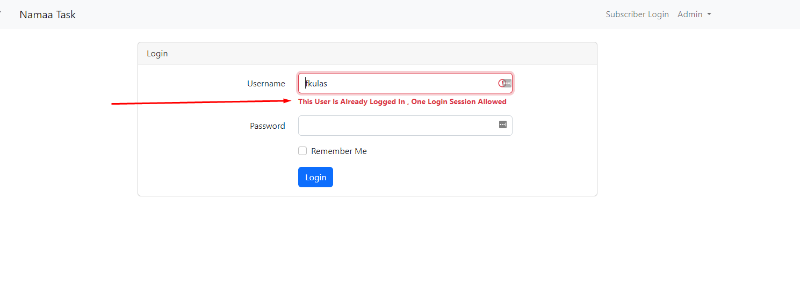

## About This Task

Simple project with protected blog section for only subscribers and once the subscriber
logged in for the first time it can’t login from other device in the future

## Install Process
- Run `https://github.com/EGYWEB-Mohamed/Namaa-Task.git`
- Run `composer install --no-dev`
- Run `cp .env.example .env or copy .env.example .env`
- Run `php artisan key:generate`
- Run `php artisan migrate`
- Run `php artisan db:seed`
- Run `php artisan serve`
- Go To Serve URL `localhost:8000 OR 127.0.0.1:8000` 
- Enjoy ♥

## Some Images

